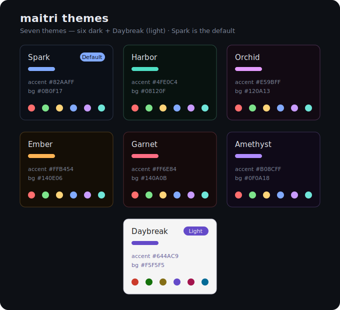

# maitri

**maitri** (pronounced *MY-tree*) is a beautiful, opinionated Linux setup made by
[Kindness](https://kindness.ai). It turns a fresh [Arch Linux](https://archlinux.org) install into a
fully configured, Hyprland-based desktop with sane defaults and a curated set of apps.

*Maitrī* is a Sanskrit word for loving-kindness — unconditional friendliness and goodwill. That's the
feeling we're after: a calmer, kinder computer.

maitri began as a friendly fork of [Omarchy](https://omarchy.org) by DHH — the Hyprland config, theming
engine, and update machinery all started there, and we owe it an enormous thanks. maitri has since grown
into its own independent project, with its own commands, packages, and identity.

## Install

### ISO (recommended)

Download the latest maitri ISO from the [Releases](https://github.com/kindness-ai/maitri/releases) page
(or build it yourself from the **Actions** tab → *Build maitri ISO*), write it to a USB stick, boot, and
follow the guided installer.

### Curl (existing Arch)

On a fresh Arch Linux install, as a sudo user:

```bash
bash <(curl -fsSL https://raw.githubusercontent.com/kindness-ai/maitri/main/boot.sh)
```

See [iso/README.md](iso/README.md) for ISO build details.

## Updating

maitri is a **living config** — improvements land in this repo and every installed machine pulls them down:

- **`maitri update`** — pull the latest maitri, run any migrations, and update system packages. Safe to
  run anytime: it takes a system snapshot first, then updates incrementally.
- **`maitri reinstall`** — re-clone maitri fresh (a clean refresh, or recovery if something's off).

## Themes

maitri ships seven themes — six dark plus **Daybreak** (light) — with a shared vivid palette. **Spark**
(deep blue) is the default; switch any time with `Super + Ctrl + Shift + Space`.



## What's inside

- **Desktop** — Hyprland (Wayland), Waybar, Walker launcher, SDDM login, Plymouth boot splash.
- **Defaults** — fish shell, Helium browser, VS Code editor.
- **Apps** — a curated set of GUI, CLI, and web apps. See [APPS.md](APPS.md).
- **Themes** — seven original maitri themes (Spark default, plus the light Daybreak).

See [maitri.md](maitri.md) for how the project is structured, built, and maintained.

## License

maitri is released under the [MIT License](https://opensource.org/licenses/MIT). It began as a fork of
Omarchy (also MIT) — thank you to DHH and the Omarchy community.
